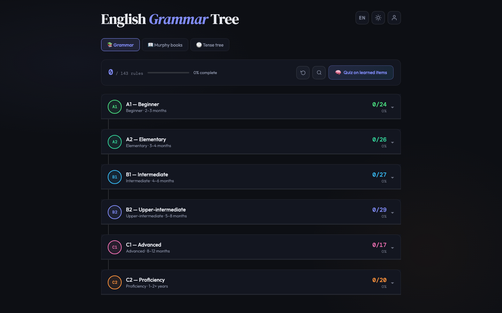
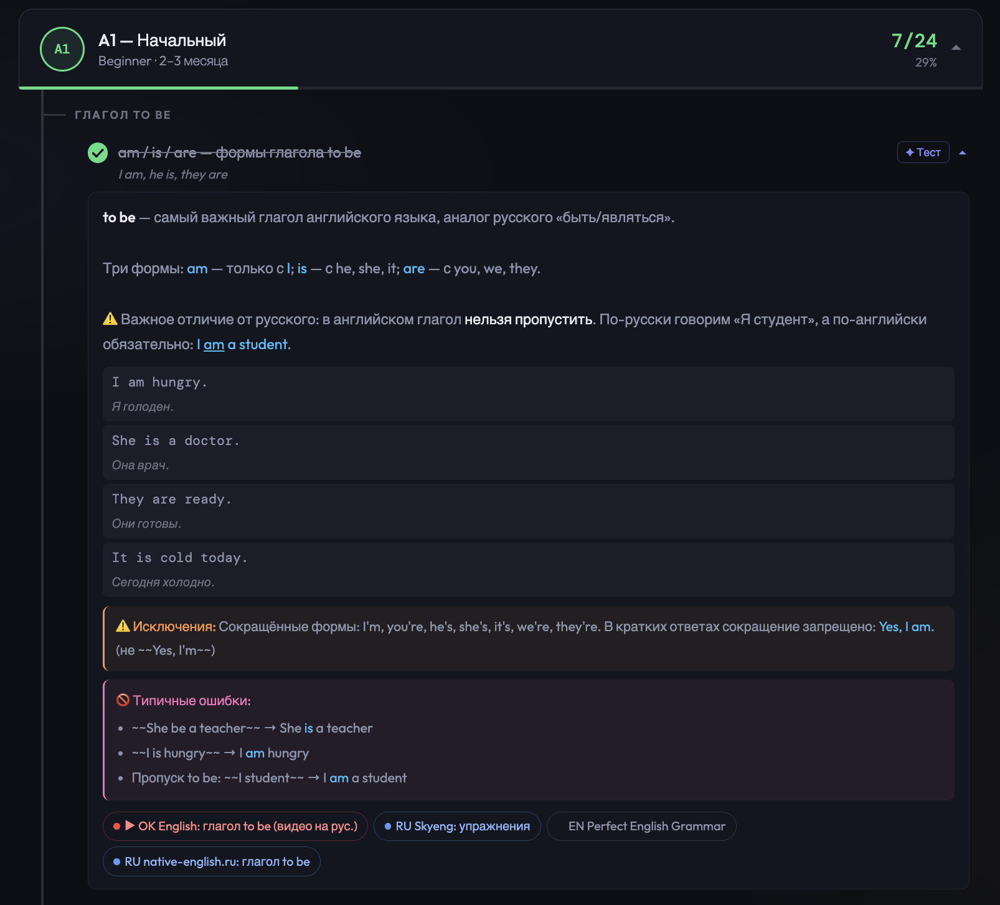
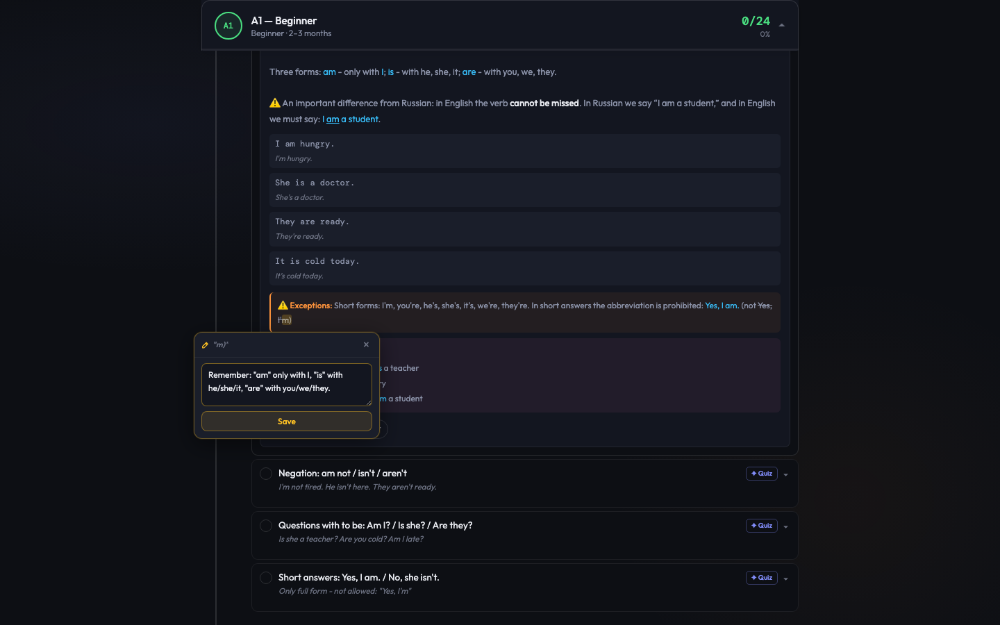
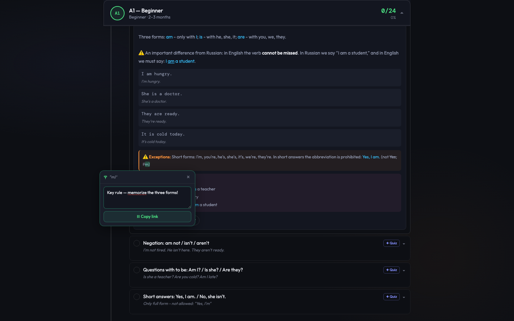
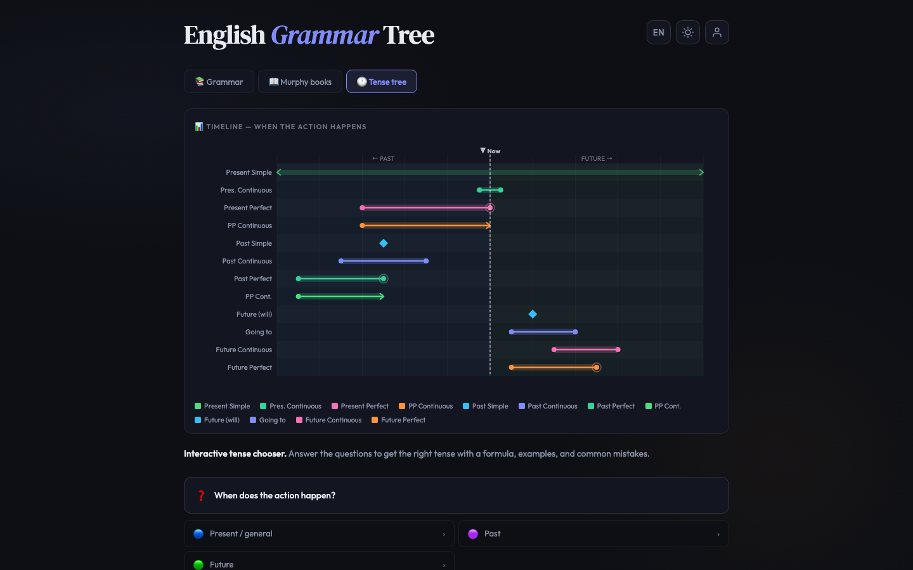
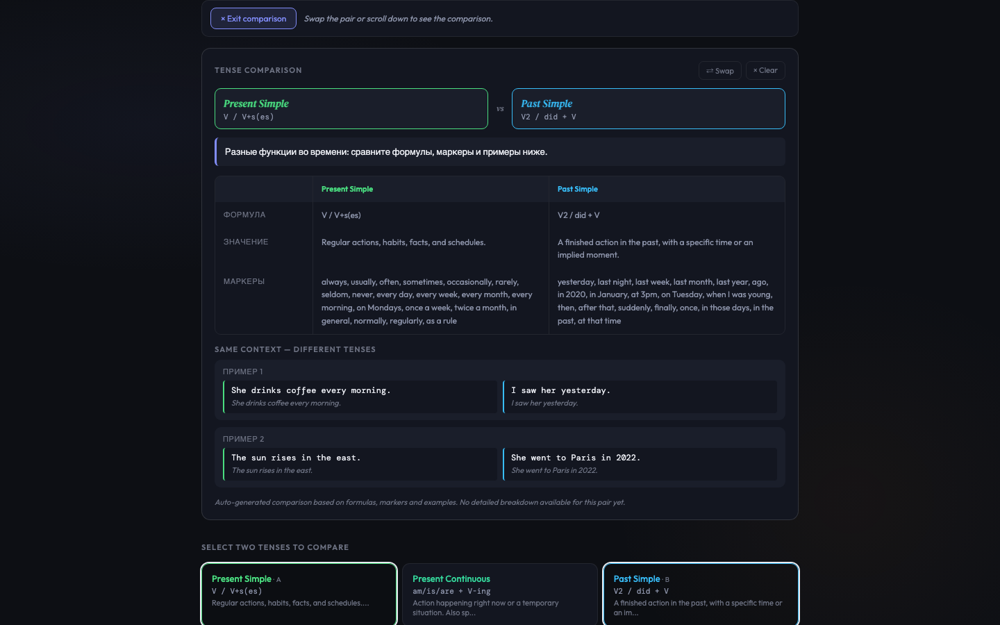
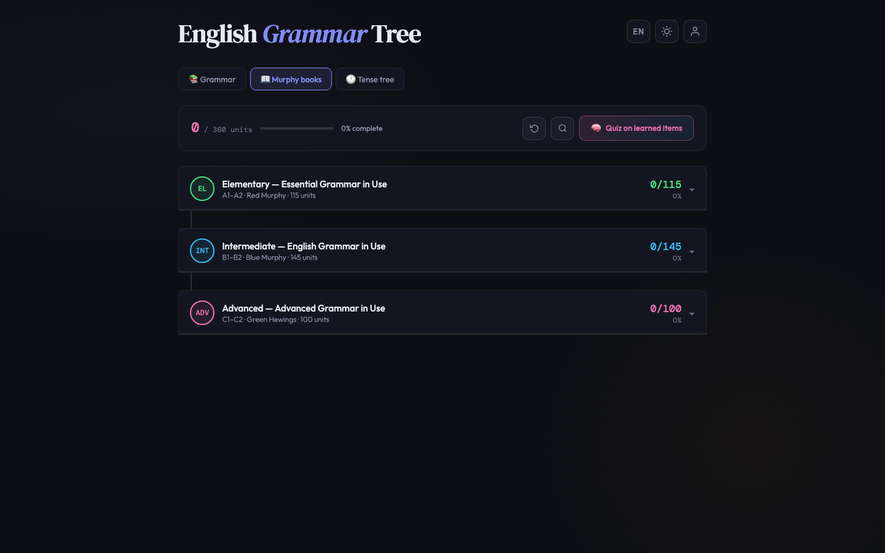
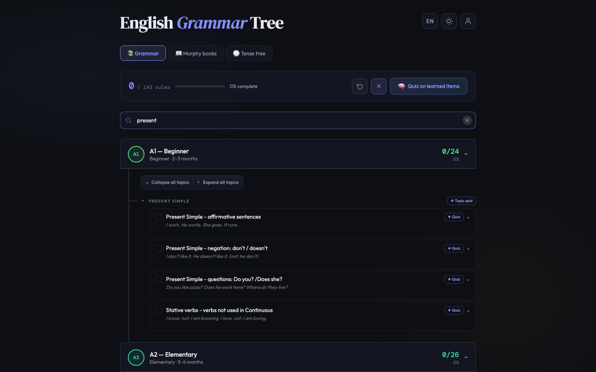
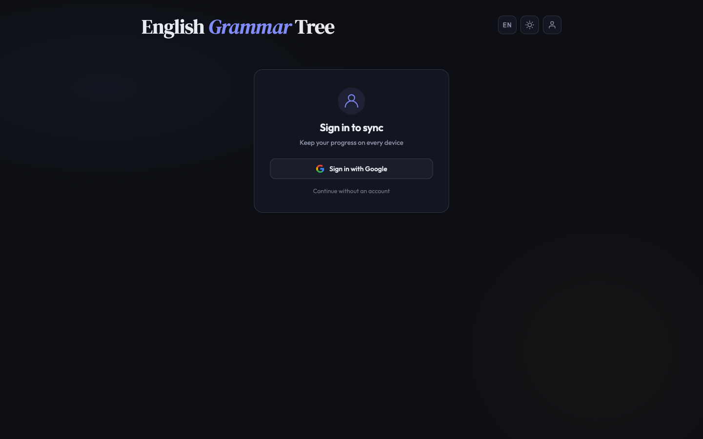
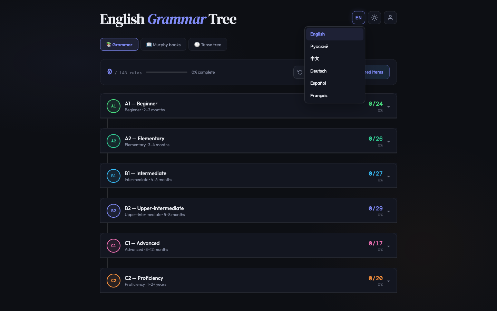

<div align="center">

# 🌳 English Grammar Tree

### An interactive, beautifully crafted companion for mastering English grammar — from A1 all the way to C2.

[](https://english-tree-garmmar.web.app)
[](https://react.dev)
[](https://www.typescriptlang.org)
[](https://vitejs.dev)
[](https://firebase.google.com)
[](https://web.dev/progressive-web-apps/)



<sub><em>☀️ Light theme · 🌙 Dark theme — switch any time, stays in sync across devices.</em></sub>

</div>

---

## ✨ Why English Grammar Tree?

Grammar textbooks are long. Apps are noisy. **English Grammar Tree** is a single, fast, focused tool that lays out the entire English grammar landscape as a tree you can climb at your own pace — with progress saved, notes, deep links, and your own personal library in the cloud.

> **Russian-first UI, multilingual core.** Originally designed for Russian-speaking learners, now localized into 🇬🇧 English, 🇷🇺 Russian, 🇩🇪 German, 🇪🇸 Spanish, 🇫🇷 French, and 🇨🇳 Chinese.

---

## 🌟 Highlights

<table>
<tr>
<td width="50%">

### 📚 Complete grammar map
All CEFR levels — **A1 · A2 · B1 · B2 · C1 · C2** — with 143+ rules, examples, exceptions, common mistakes, and curated video/article links.

</td>
<td width="50%">

### 🕰 All 12 tenses, one clear tree
A decision tree guides you from "what are you trying to say?" to the right tense, backed by a visual timeline and side-by-side **tense comparisons**.

</td>
</tr>
<tr>
<td>

### 📖 Murphy companion
A dedicated **Murphy** tab mirroring the famous *English Grammar in Use* structure — every unit with its own description, progress, and notes.

</td>
<td>

### 🔗 Shareable deep links
Share a rule, a tense, or even a **selected sentence** — the recipient opens the link, the app scrolls, expands, and highlights *exactly* the passage you meant.

</td>
</tr>
<tr>
<td>

### ☁️ Account sync
Sign in with Google, GitHub, or email. Progress, notes, and pinned items sync across devices through Firestore — with a smart merge dialog on first sign-in.

</td>
<td>

### 🌗 Themes & motion
A polished **light/dark theme** (no flash on load), particle animations on rule completion, and smooth CSS transitions throughout.

</td>
</tr>
</table>

---

## 🧩 Features in detail

### 📐 Grammar rules — organized, expandable, searchable



Each rule card contains everything you need in one place:

- 🧠 **Plain-language explanation** with rich HTML formatting
- ✍️ **Examples with translations** to your interface language
- ⚠️ **Exceptions** and real-world edge cases
- 🚫 **Common mistakes** Russian speakers make
- 🔗 **Reference links** — YouTube, Russian articles, English sources
- ✅ **Done / Undone** toggle with celebratory particle burst
- 📌 **Pin** important passages and leave yourself a message
- 📝 **Personal notes** attached to any selection of text

<table>
<tr>
<td width="50%">



**📝 Notes** — highlight any sentence inside a rule and jot down your own reminder. Notes live on the selection itself, follow you across devices, and never clutter the main explanation.

</td>
<td width="50%">



**📌 Pinned passages** — lock down the sentence that always trips you up and attach a short note. The pin sticks to the exact range, survives reloads, and is shareable.

</td>
</tr>
</table>

### 🕓 Tenses — explore, compare, understand



- **Timeline visualization** — see at a glance how all 12 tenses line up across past, present, and future
- **Interactive decision tree** — a few guided questions and you land on the right tense, with formula, examples, and pitfalls
- **Formulas, markers, examples, common mistakes** — always one tap away

And when two tenses feel confusingly similar, compare them side-by-side:



**Tense comparison** *(new!)* — pick any two tenses and the app lines up their formulas, markers, and contrasting example sentences in the same sentence context. Perfect for Present Simple vs. Present Continuous, or Past Simple vs. Present Perfect.

### 📖 Murphy companion



A dedicated **Murphy books** tab mirroring the canonical *English Grammar in Use* series — **Elementary**, **Intermediate**, and **Advanced Grammar in Use** — with **360+ units** in total. Each unit carries its own description, independent progress, and supports the same notes, pinning, deep linking, and AI quiz prompts as the main grammar tree.

### 🔗 Deep links — share any rule, tense, or text passage

Every grammar rule and every tense has a **share button** (⛓). But you can go further — **select any text** inside a rule and share *that specific passage*.

<table>
<tr>
<td width="50%">


**1.** Select any text inside an expanded rule.
**2.** A floating **"⛓ Share selection"** button appears.
**3.** Click — the URL with the exact text range is copied.

</td>
<td width="50%">


**4.** Recipient opens the link.
**5.** App navigates, scrolls, expands the rule.
**6.** The passage glows bright green until first interaction.

</td>
</tr>
</table>

Deep links work across all three tabs — **Grammar**, **Murphy**, and **Tenses**.

### 📊 Progress tracking

- Mark rules as **done / not done** — persisted locally and, if signed in, to the cloud
- Dashboard shows overall progress %, completed rules, and finished CEFR levels
- Separate progress tracks for **Grammar** and **Murphy**
- Reset progress at any time

### 🔍 Full-text search



- Matches across rule titles, notes, explanations, examples, and exceptions
- Matching categories and levels **auto-expand** as you type so you see context, not just hits
- Mobile-friendly search bar that collapses gracefully on small screens

### 🤖 AI-assisted practice

- Generate a **ChatGPT / Claude-ready prompt** for any single rule, or for all rules you've completed
- One-click copy to clipboard — paste anywhere and get an instant custom quiz
- Prompts are localized to your UI language

### 🔐 Sign in & sync

<table>
<tr>
<td width="55%">

- Sign in with **Google**, **GitHub**, or **email + password**
- First-time sign-in with existing local progress? A clean **merge dialog** lets you decide what to keep
- Real-time sync to Firestore — progress, notes, pinned items, and theme
- Sign out any time without losing your local history
- Continue fully offline without an account — sync is optional

</td>
<td width="45%">



</td>
</tr>
</table>

### 🌍 Languages

<table>
<tr>
<td width="55%">

Full UI localization with i18next, covering 6 languages:

| 🇬🇧 English | 🇷🇺 Русский | 🇩🇪 Deutsch | 🇪🇸 Español | 🇫🇷 Français | 🇨🇳 中文 |
|:-:|:-:|:-:|:-:|:-:|:-:|

Translation bundles are **lazy-loaded** per language — no wasted bytes. The picker in the header switches UI, example translations, and AI quiz prompt language simultaneously.

</td>
<td width="45%">



</td>
</tr>
</table>

### ⚡ Performance & offline

- **PWA** — install to home screen, works offline
- **Lazy-loaded routes** — each tab arrives only when opened
- **No flash** theming — theme class applied before first paint
- Biome-linted, tree-shaken, Vite-optimized

---

## 🛠 Tech Stack

| Layer | Technology |
|---|---|
| 🎨 UI | React 18 + TypeScript |
| ⚡ Build | Vite 6 |
| 🌐 i18n | i18next + react-i18next (6 locales, lazy loaded) |
| 🔥 Backend | Firebase Auth + Firestore |
| 📱 PWA | vite-plugin-pwa |
| 🧹 Lint / Format | Biome |
| 🪝 Git hooks | Husky + lint-staged |
| 🚀 Hosting | Firebase Hosting |

---

## 📂 Project structure

```
english-grammar-tree/
├── app/
│   ├── components/
│   │   ├── Grammar/        # Grammar rules tab
│   │   ├── Murphy/         # Murphy companion tab
│   │   ├── Tenses/         # Tree, timeline, comparison, result
│   │   ├── Auth/           # Sign-in / sign-up screens
│   │   ├── Account/        # Account management page
│   │   ├── MergeDialog/    # Local ↔ cloud progress merge UI
│   │   └── Header/         # Search, tabs, theme toggle, language picker
│   ├── context/            # Auth + sync context providers
│   ├── data/               # Grammar, tenses, tree & timeline data
│   ├── hooks/              # useProgress, useNotes, useTheme
│   ├── i18n/               # Locales, AI prompt templates, rule translations
│   ├── services/           # Firestore service, sync registry
│   └── utils/              # Deep links, selection, clipboard, particles
├── public/                 # PWA assets
├── scripts/                # Build / maintenance scripts
└── screenshots/
```

---

## 🚀 Getting started

**Prerequisites:** Node.js 18+

```bash
# Install
npm install

# Develop
npm run dev

# Build
npm run build

# Deploy to Firebase
npm run deploy
```

Other scripts:

```bash
npm run lint      # Biome lint check
npm run format    # Auto-format
npm run check     # Format + lint fix
npm run preview   # Preview production build
```

---

## 🧾 Data format

Grammar rules are typed and easy to extend:

```typescript
{
  id: 'a1_01',
  text: 'am / is / are — формы глагола to be',
  note: 'Short summary',
  exp: '<p>Full HTML explanation</p>',
  ex: [['I am a student.', 'Я студент.'], /* ... */],
  exc: 'Special cases and exceptions',
  mistakes: ['Common mistake description', /* ... */],
  links: [{ label: 'Video', url: '...', type: 'yt' | 'ru' | 'en' }],
  markers: { tags: ['...'], note: '...' }
}
```

---

## 📜 License

MIT — learn, fork, share.

<div align="center">

---

Made with ❤️ for English learners everywhere.
**[Try it live →](https://english-tree-garmmar.web.app)**

</div>
